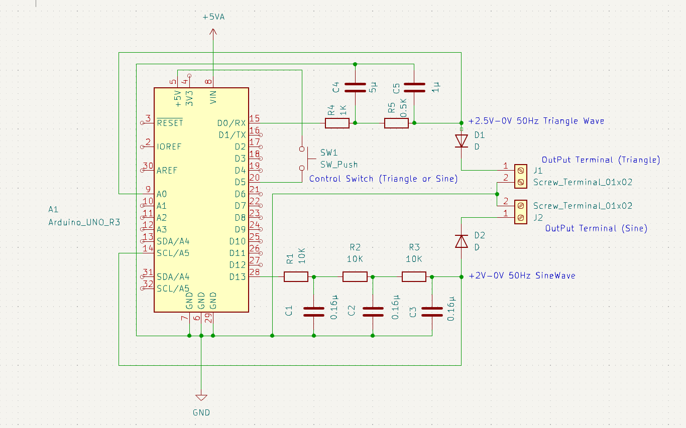
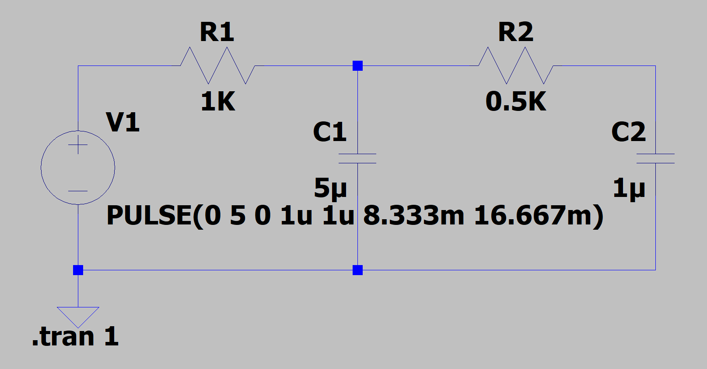
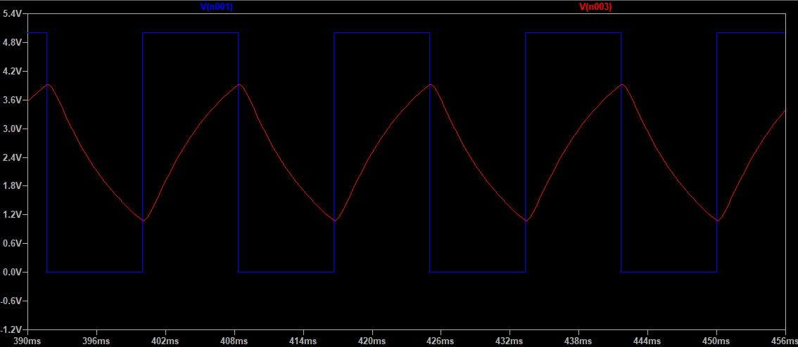
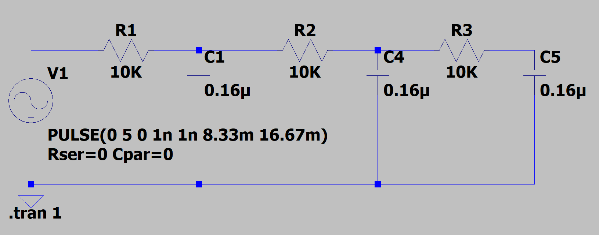
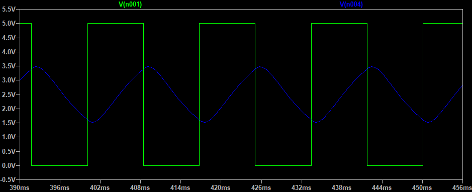

# Square Wave to Triangle and Sine Wave Generator

This project generates a 60 Hz square wave using an Arduino and converts it into triangle and sine waveforms through RC (Resistor-Capacitor) filters. The project enables waveform toggling between output pins and reads analog values to observe the wave transformations.

## Table of Contents

- [Project Overview](#project-overview)
- [Circuit Schematic](#circuit-schematic)
- [Waveform Conversions](#waveform-conversions)
- [Components](#components)
- [Arduino Connections](#arduino-connections)
- [Usage Instructions](#usage-instructions)
- [Troubleshooting](#troubleshooting)

## Project Overview

This project produces square waves and converts them into triangle and sine waves using RC filters. It allows toggling between output pins for waveform selection and reads analog signals to monitor waveform characteristics.

## Circuit Schematic

Here is the schematic of the square wave generator with RC filtering to produce triangle and sine waveforms:

## Waveform Conversions

1. **Square Wave to Triangle Wave**

   The RC filter smooths the square wave to form a triangle wave.

   - **Circuit Diagram**  
     

   - **Output Waveform**  
     

2. **Square Wave to Sine Wave**

   Additional RC filtering transforms the square wave into a sine-like waveform.

   - **Circuit Diagram**  
     

   - **Output Waveform**  
     

## Components

- **Arduino**: For generating square waves and reading analog signals.
- **Resistor and Capacitor**: RC components to shape the waveform.
- **Switch**: To toggle the output pins.

## Arduino Connections

| **Component**            | **Arduino Pin** |
|--------------------------|-----------------|
| Square Wave Output 1     | Pin 15          |
| Square Wave Output 2     | Pin 0           |
| Switch                   | Pin 5           |
| Triangle Wave Analog In  | Analog Pin A0   |
| Sine Wave Analog In      | Analog Pin A5   |
| Power                    | 5V and GND      |

## Usage Instructions

1. **Upload Code**: Load the code onto your Arduino.
2. **Power On**: Connect the Arduino to a USB or external power source.
3. **Toggle Output**: Press the switch to toggle between output pins for square wave generation.
4. **Monitor Output**: Use an oscilloscope to observe the output waveforms. Read the analog values to analyze waveform transformations.

## Troubleshooting

- **Waveform Distortion**: Ensure RC filter connections are secure and correct.
- **No Output**: Verify Arduino pin configurations and switch connections.
- **Unstable Readings**: Check analog input wiring and RC component values.
